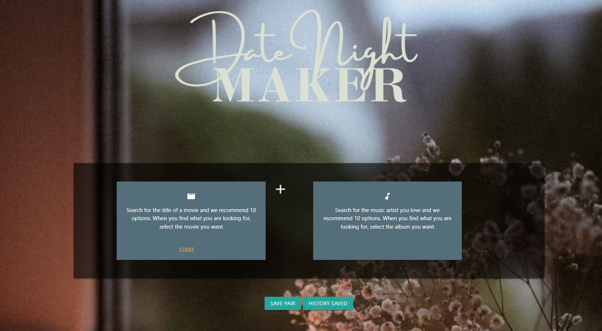
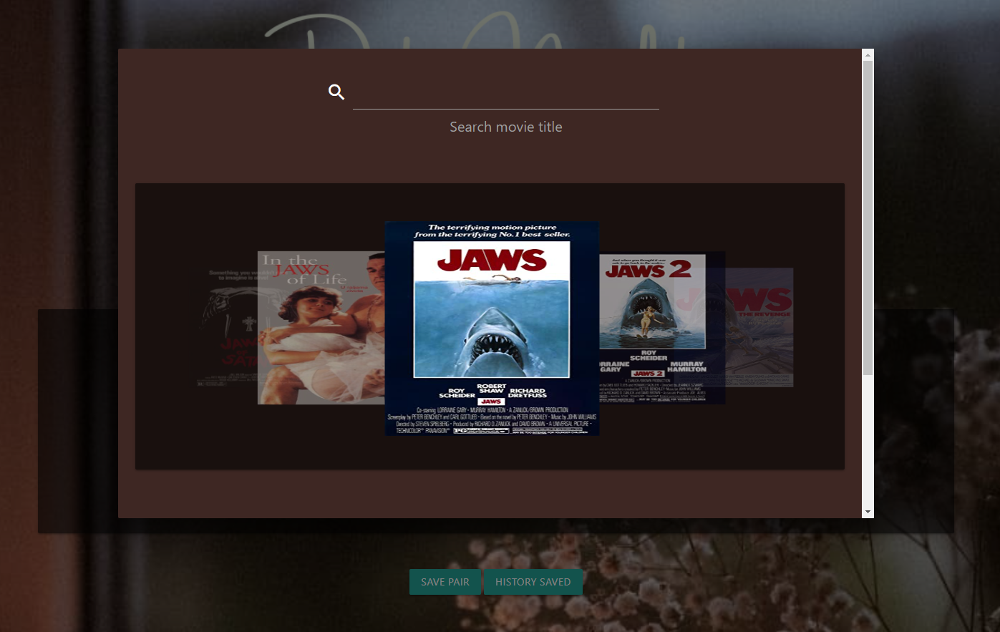
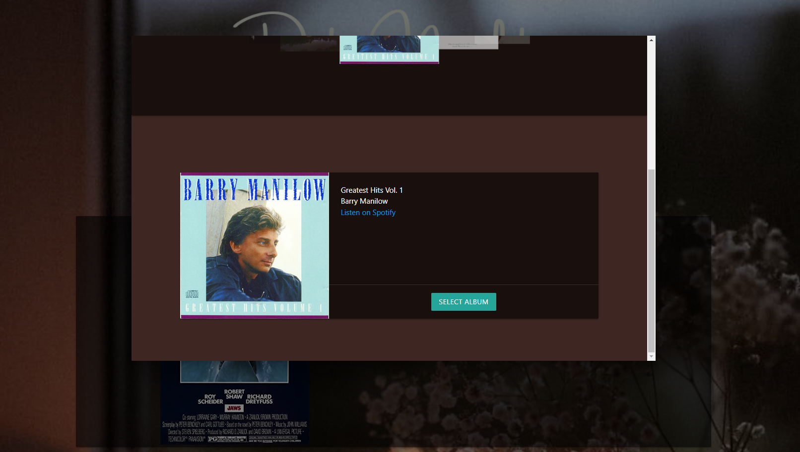

# The Date Night Maker
An app to pair a movie with a music album.

## Description
The Date Night Maker app allows for simple search functionality of movies and albums so a user may create a pairing, with pairings remembered for future reference. This allows users to prepare for a night in quickly, or grab information from the past to replicate a successful evening.

## Installation and Usage

Web application, hosted at: https://tomasdiaz83.github.io/TheMatchmakersWebsite/

## Screenshots

The following images show the web application's appearance and functionality:

## Credits
The Date Night Maker was contributed to by the following:
Tomas Diaz (https://github.com/tomasdiaz83/) - JavaScript
Lisbett Cortes (https://github.com/lcortes0801) - HTML, CSS, and JavaScript
Alfredo Huerta (https://github.com/Huertz) - Development
Dexter Randle (https://github.com/DforDexter) - Development
Zinia Quintanilla (https://github.com/ZiniaQ) - Development

## License

Copyright 2022 Tomas Diaz

Permission is hereby granted, free of charge, to any person obtaining a copy of this software and associated documentation files (the "Software"), to deal in the Software without restriction, including without limitation the rights to use, copy, modify, merge, publish, distribute, sublicense, and/or sell copies of the Software, and to permit persons to whom the Software is furnished to do so, subject to the following conditions:

The above copyright notice and this permission notice shall be included in all copies or substantial portions of the Software.

THE SOFTWARE IS PROVIDED "AS IS", WITHOUT WARRANTY OF ANY KIND, EXPRESS OR IMPLIED, INCLUDING BUT NOT LIMITED TO THE WARRANTIES OF MERCHANTABILITY, FITNESS FOR A PARTICULAR PURPOSE AND NONINFRINGEMENT. IN NO EVENT SHALL THE AUTHORS OR COPYRIGHT HOLDERS BE LIABLE FOR ANY CLAIM, DAMAGES OR OTHER LIABILITY, WHETHER IN AN ACTION OF CONTRACT, TORT OR OTHERWISE, ARISING FROM, OUT OF OR IN CONNECTION WITH THE SOFTWARE OR THE USE OR OTHER DEALINGS IN THE SOFTWARE.